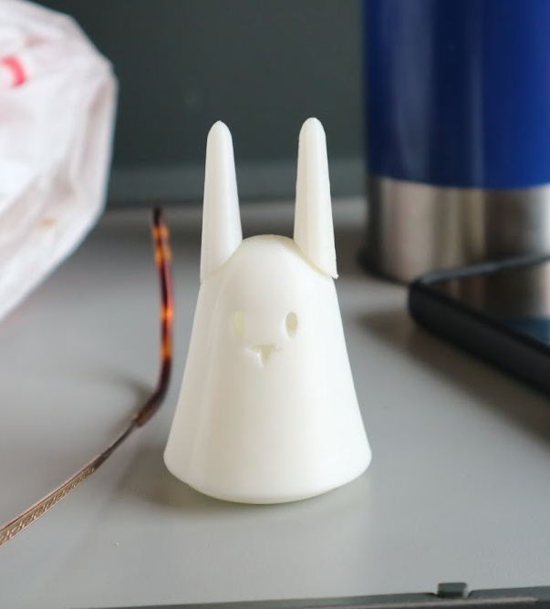
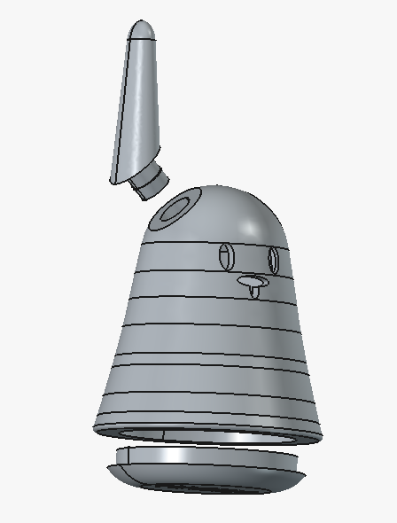
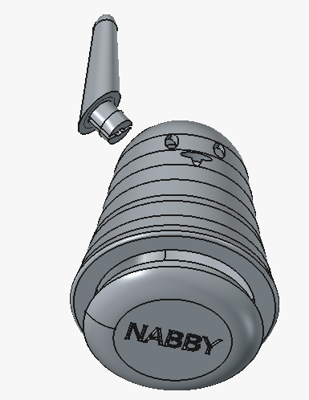

# Welcome to the Nabi-nano-3d-Freecad based design.

The tiny Nabaztag is intended to house a Seeed Studio XIAO ESP32C6 module with battery. The different variants (will) contain sensors or small displays.

TAGS KAROTZ NABAZTAG NANOZTAG ESP32 

The Freecad model is based on the .stl file from: *Nanoztag clone by clarionut on Thingiverse: https://www.thingiverse.com/thing:3719998*.

The .stl is redrawn with a Freecad sketch and rotation for the body and ears and bottom cap.

Nanoztag clone by clarionut is licensed under the Creative Commons - Attribution - Non-Commercial - Share Alike license. (CC‑BY‑NC‑SA)

The Nabby-nano Freecad design is also publiished under Creative Commons license: CC‑BY‑NC‑SA.

Nabby hardware and software projects are free/libre works: you may redistribute them and/or modify them under the terms of the GNU General Public License (GPL) as published by the Free Software Foundation, either version 3 of the License or any later version. This includes source code, firmware, hardware designs, schematics, PCB layouts, and related documentation, unless a specific component is explicitly marked otherwise. Nabby projects are distributed in the hope that they will be useful, but without any warranty; without even the implied warranty of merchantability, fitness for a particular purpose, or non‑infringement. For the complete license text, see the GNU General Public License at: https://www.gnu.org/licenses/
